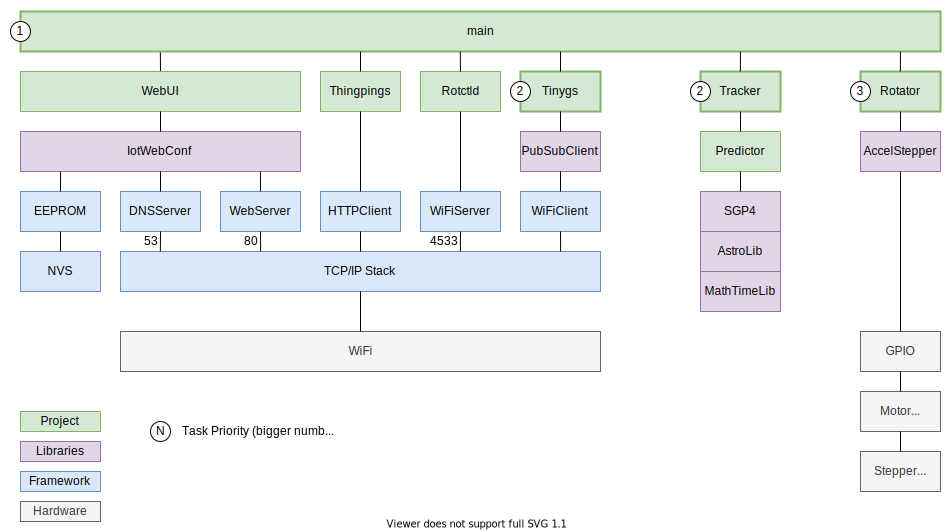

# 

## Description

Orbitrakr is an antenna rotator controller, for pointing an antenna at satellites in low earth orbit. An ESP32 microcontroller board runs the Orbitrakr firmware, and two stepper motors drive the azimuth and elevation axes of the rotator, which points the antenna.

This repository contains the controller firmware.

This is the developer documentation for those interested in understanding the source code or contributing to the project. For the end-user documentation, which covers the features of the software and how to use it, please see the [Orbitrakr website](https://mdkendall.github.io/Orbitrakr) on GitHub Pages.

## Architecture

## Libraries Used

- [IotWebConf](https://github.com/prampec/IotWebConf) Wi-Fi web configuration portal
- [AccelStepper](https://github.com/waspinator/AccelStepper) Stepper motor driver
- [ArduinoJson](https://github.com/bblanchon/ArduinoJson) JSON library
- [PubSubClient](https://github.com/knolleary/PubSubClient) MQTT client

Inspiration and some source code from [TinyGS](https://github.com/G4lile0/tinyGS).

## References

Vallado, David A., Paul Crawford, Richard Hujsak, and T.S. Kelso, "Revisiting Spacetrack Report #3" presented at the AIAA/AAS Astrodynamics Specialist Conference, Keystone, CO, 2006 August 21–24.

- https://celestrak.com/publications/AIAA/2006-6753/
- https://celestrak.com/publications/AIAA/2006-6753/AIAA-2006-6753.zip

David Vallado, "Fundamentals of Astrodynamics and Applications, Fourth Edition", Microcosm Press 2013

- https://celestrak.com/software/vallado-sw.php
- https://celestrak.com/software/vallado/cpp.zip
