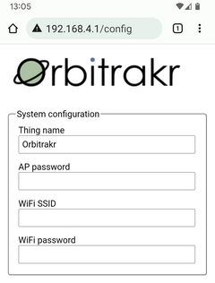

# Configuration

On initial startup Orbitrakr creates a Wi-Fi access point with SSID `Orbitrakr` and password `password`. Connect to this, for example from a smartphone. Open a web browser and navigate to `192.168.4.1` - your phone may do this automatically for you when you connect since Orbitrakr presents a "captive portal". When prompted, enter username `admin` and password `password`. You should see the Configuration page.

On the configuration page enter the SSID and password for your regular Wi-Fi network. Also, choose a password that will protect the Configuration page in future.

This is the minimum information that must be entered. You can enter more, but it is probably more convenient to allow Orbitrakr to connect to your Wi-Fi network and then enter the remaining information via a browser on a desktop or laptop computer. Scroll down and TODO. If all goes well Orbitrakr will restart and connect to your network.

Orbitrakr supports the Thingpings service. To find the device on your local network you can visit [www.thingpings.com](https://www.thingpings.com) and click on the Things tab. Click Refresh if you don't immediately see it.

Open a web browser and browse to the address of the device on your local network. From the menu, choose Configuration. When prompted, enter the password you previously configured. The username is always `admin`. Now the remaining settings can be configured.

## Rotator

## Tracker

If you want to track a specific satellite, enter its NORAD catalog number (typically five decimal digits).

Enter the latitude (-90 to +90) and longitude (-180 to +180) of the Orbitrakr location. This information is needed to calculate the "look angle" of a satellite at a given position in orbit from your location on the ground. Three decimal places of precision is sufficient.

## TinyGS Station

Orbitrakr can follow a TinyGS station that is using the Auto Tune feature to configure its receiver for different satellites as they come in to view. If you want Orbitrakr to automatically track the satellite that such a station is listening to, enter your TinyGS MQTT username and password, and the name of the station. The MQTT username and password are the ones that you get from the TinyGS Personal Bot on Telegram when you set up your station. The station name must be the same as it is entered in the TinyGS station configuration, the same as it appears on the TinyGS web site.

## Troubleshooting

When it starts up Orbitrakr offers its own Wi-Fi access point for about 30 seconds to allow you to connect directly if desired. If you don't, it will then attempt to connect to the Wi-Fi network that has been configured. If it cannot connect (for example because the password is wrong, or it is out of range) it will go back to offering its own access point. So, if it does not appear on your network try reconnecting to it via the `Orbitrakr` access point.

For the Thingpings service to work, Orbitrakr must be able to access the internet. It needs internet connectivity for other functionality too (such obtaining the time via NTP, and obtaining TLEs from CelesTrak) so ensure that routers and/or firewalls are not configured to block it. Orbitrakr only needs outbound access - you do not need to forward any ports to it.

For the Configuration page, the username is always `admin` and the password is whatever you set it to.
