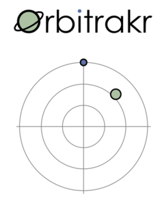
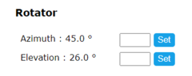
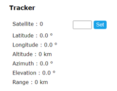
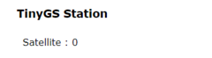

# Dashboard

Open a web browser and browse to the address of the device on your local network. From the menu, choose Dashboard.

The main feature of the dashboard is a polar chart showing where the rotator is currently pointing, and the location of the satellite currently being tracked. The chart shows azimuth with north (0°) at the top, west (-90°) to the left, and east (+90°) to the right. Elevation is shown with the horizon (0°) at the edge, and straight up (90°) in the centre.

Below this chart the dashboard shows the current state of all modules and the values of many internal variables. The values update live in real time. The value of some variables can be manually set via a data entry field and associated button.

## Rotator

The dashboard shows the current azimuth and elevation of the rotator. If the rotator is moving these values will be changing.

New target values may be entered to manually command the rotator to point in a specific direction. Note that if the Tracker is currently tracking a satellite - either manually specified or determined by the TinyGS follower - your commanded target will be overridden almost immediately.

## Tracker

The dashboard shows the NORAD catalog number of the satellite that is currently being tracked.

The satelite's predicted latitude, longitude and altitude are shown, together with the calculated azimuth, elevation and range as seen from the configured location. If the satellite is above the horizon the azimuth and elevation are used to command the rotator.

The tracker predicts the position of the satellite based on orbital parameters in the form of "Two-Line Element" sets fetched from from Celestrak, and a built-in implementation of the Simplified General Perturbations (SGP4) propagator.

A new satellite may be tracked by manually entering its NORAD catalog number.

## TinyGS Follower

The dashboard shows the catalog number of the satellite that the configured TinyGS station is currently listening to.

The satellite catalog number is used to command the tracker, which in turn commands the rotator.

Orbitrakr is only informed of a new catalog number when the TinyGS system commands the station to listen to a new satellite. So for this feature to be useful the station should be using the 'Auto Tune' feature. Note that after start-up there will be a delay before the first update is received. Thereafter, as the station is commanded to listen to different satellites Orbitrakr will automatically track them.
