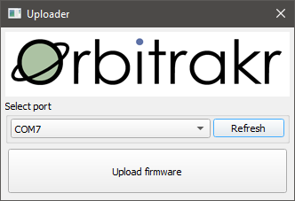

# Firmware

The firmware can be found in the [Orbitrakr source code repository](https://github.com/mdkendall/Orbitrakr) on GitHub.

## Binaries

In addition to the source code, the latest release provides pre-compiled binaries.

- `orbitrakr-full.bin` is a complete all-in-one image containing the application itself along with the second-stage bootloader and partition table. It is suitable for programming a blank ESP32, for example using Espressif's `esptool.py`.
- `orbitrakr-ota.bin` is just the application. It is suitable for over-the-air updating an existing system.

## Uploader

Also provided is a one-click uploader program. It will automatically fetch the latest firmware from GitHub and program it in to an attached ESP32 board. There is a version for Windows and macOS. This is the easiest way to program a board if you do not have the Espressif toolchain installed.

