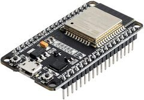
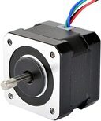
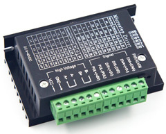

# Hardware

The Orbitrakr project does not require specific hardware. Many controller boards are suitable for running the firmware, and the design and construction of a mechnical rotator depends on the antenna you wish to rotate.

## Controller

The firmware is developed and tested using a ESP32 DevKit v1 board. However, the firmware should run on most ESP32-based boards. The minimum requirement is 4MB of Flash memory and enough digital pins to connect the motor drivers.

The board can be provided with power via the USB connector or the `VIN` pin. The USB connector is more convenient for initial programming and testing, whereas making a soldered connection to `VIN` is more robust for long-term operation. In either case, do not attempt to power the motors and/or drivers from any of the power outputs on the ESP32 module; they cannot supply sufficient current.

## Motors and Drivers

### Small

The firmware is developed and tested using 28BYJ-48 stepper motors and ULN2003-based driver boards, using the "4-wire" configuration. This is probably the cheapest, smallest and most straightforward configuration, and can be powered from 5V DC. Both the motors and driver boards are available as generic items very inexpensively, often bundled together. However, these motors are low-speed and low-torque, and are only suitable for rotating small antennas.

In this configuration the coils of the motor are directly controlled by the ESP32, and the driver is nothing more than a set of power transistors capable of handling the required current.

### Medium

The next step up is to use NEMA-standard stepper motors. The least expensive option is probably NEMA-17 motors with generic `TB6600` drivers, which are widely available, again often bundled together. These drivers accept Step and Direction signals and are typically powered from 12V DC or higher.

In this configuration the ESP32 simply pulses the Step signal every time it wants the motor to move and the driver keeps track of which coils should be powered with what polarity at any given time. The driver may also include features such as reducing the drive current when the motor is stationary to reduce power consumption.

### Large

For large and heavy antennas, larger stepper motors with correspondingly more powerful drivers will be required.

## Rotator

TODO
